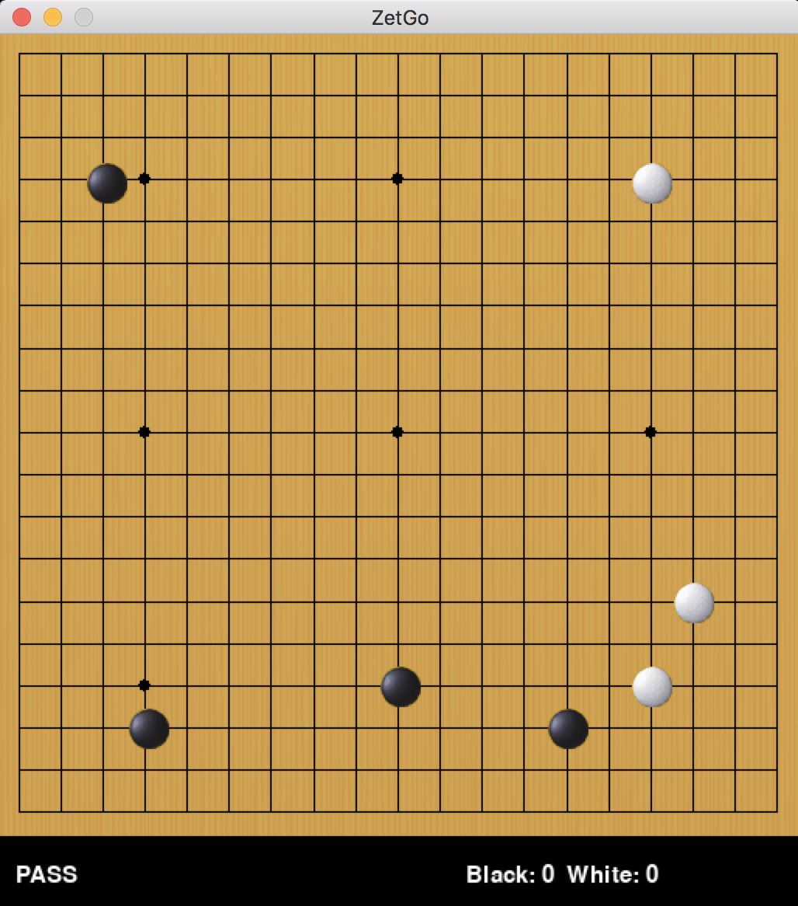

=====
zetgo
=====
]

A minimal go/baduk program, for use with machine learning. Still very much a WIP

Description
===========

The goal of this project is to provide an API for machine learning algorithms to play the game of Go.

It contains a minimal GUI for interacting with the bots.

Code borrowed and modified from:

https://github.com/xyproto/monkeyjump (display examples)

https://github.com/blackicetee (Zobrist Hash)

Note
====

This project has been set up using PyScaffold 3.0.2. For details and usage
information on PyScaffold see http://pyscaffold.org/.

TODOs
=====

- Resign functionality for the api (and button in ui)
- Value method for returning win/loss to the agent
- UI updates for board sizes other than 19
- Back button
- Document the api
- GameState method for DeepReinforcementLearning 
- Clean up UI
